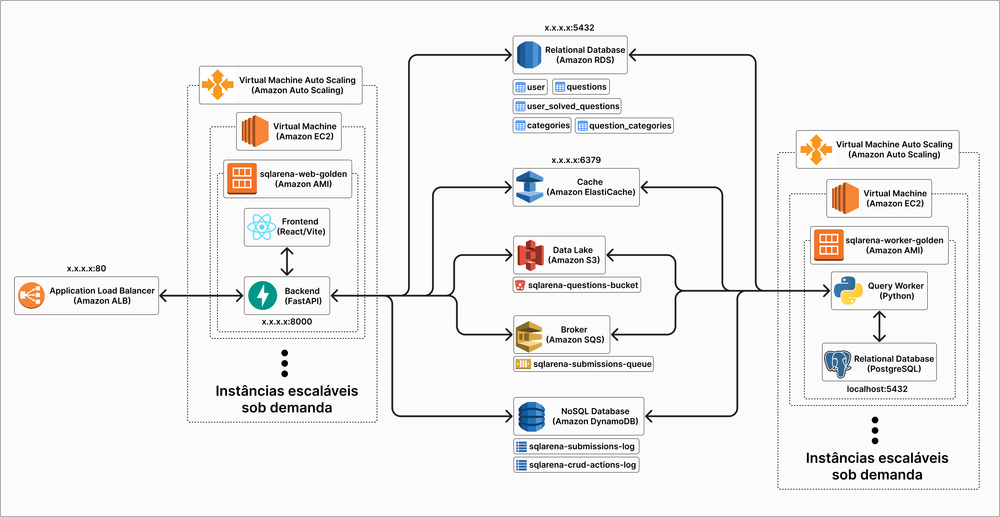

# ⚔️ SQLArena - Plataforma de Ensino e Avaliação de SQL

Plataforma distribuída para prática e avaliação de consultas SQL em ambiente real **PostgreSQL 16** com isolamento por schemas (Sandbox), avaliação assíncrona desacoplada via **Amazon SQS**, cache de validação via **Redis** e Infraestrutura como Código via **Terraform**.

---

## 🏛️ Arquitetura do Sistema

<p align="center">
  
</p>

### Componentes e Papéis na Arquitetura

* ⚖️ **Application Load Balancer (ALB):** Ponto de entrada público na porta 80, distribuindo tráfego para a Camada Web e roteando callbacks internos dos Workers.
* 🌐 **Camada Web (FastAPI + React SPA no ASG 1):** Gerencia autenticação JWT, CRUD de questões, rate limit e despacho assíncrono de submissões. **É o único componente que se conecta ao Amazon RDS e ao ElastiCache Redis**. Faz upload dos scripts SQL no **Amazon S3**, publica mensagens no **Amazon SQS**, processa callbacks de conclusão dos Workers (`POST /api/submissions/callback`) para creditar +10 XP no RDS, e **lê/escreve no Amazon DynamoDB** o histórico de submissões e logs de auditoria.
* 🪣 **Amazon S3 (Armazenamento de Objetos):** Bucket dedicado (`sqlarena-questions-bucket`) onde residem exclusivamente os scripts SQL puros de cada questão (`schema.sql`, `data.sql` e `answer.sql`) sob o prefixo `questions/{id}/`.
* 📬 **Amazon SQS:** Fila de mensageria assíncrona (`sqlarena-submissions-queue` + DLQ) que desacopla o envio da execução, absorvendo picos de concorrência.
* ⚡ **Camada de Workers (ASG 2):** Processamento em background **100% desacoplado do RDS e do Redis**. Cada nó EC2 mantém seu próprio **PostgreSQL Local em Sandbox** (`localhost:5432`). Consome a fila SQS, faz o download sob demanda dos scripts do **Amazon S3** (*lazy loading*), armazena hashes de gabaritos em memória RAM ($O(1)$), executa a query do aluno em sandbox com isolamento estrito e notifica o término da avaliação via HTTP callback para o **ALB / FastAPI**.
* 🗄️ **Amazon RDS (PostgreSQL 16):** Banco relacional gerenciado central acessado exclusivamente pela Camada Web. Armazena usuários, progresso consolidado (+10 XP) e metadados das questões e categorias.
* 🏎️ **Amazon ElastiCache (Redis):** Cache em memória de baixa latência acessado exclusivamente pela Camada Web para rate limiting de 5s por aluno e recuperação imediata em $O(1)$ de gabaritos e status de polling.
* 📄 **Amazon DynamoDB:** Banco NoSQL serverless para histórico imutável de todas as submissões executadas e log de auditoria administrativa. **Consultado pelo Backend** para alimentar as telas de histórico, progresso e auditoria.

---

## 🧭 Visão dos Dois Ambientes: Local vs Nuvem AWS

O projeto foi desenhado para funcionar de forma idêntica em dois cenários:

| Recurso | 1. AMBIENTE LOCAL (Desenvolvimento no PC) | 2. NUVEM REAL (AWS Academy Learner Lab) |
| :--- | :--- | :--- |
| **Infraestrutura Base** | Docker Compose: Postgres 16 + Redis 7 + Ministack AWS | AWS Gerenciada (RDS Postgres, ElastiCache Redis, VPC, Subnets) |
| **Serviços AWS Emulados** | S3, SQS, DynamoDB no Ministack (Porta 4566) | S3, SQS + DLQ, DynamoDB nativos da AWS |
| **Terraform Workspace** | `envs/local.tfvars` | `envs/aws.tfvars` + `envs/credentials.tfvars` |
| **Camada Web** | Terminal 1 (`uvicorn`) + Terminal 3 (`npm run dev`) | Instâncias EC2 gerenciadas por Auto Scaling Group (Web ASG) |
| **Camada de Workers** | Terminal 2 (`python app/worker/main.py`) | Instâncias EC2 gerenciadas por Auto Scaling Group (Worker ASG) |
| **Ponto de Entrada** | Frontend em `http://localhost:5173` | DNS público do Application Load Balancer (`alb_dns_name`) |

---

## 📂 Estrutura e Organização do Projeto

```text
SQLArena/
├── app/
│   ├── api/            # Rotas REST (FastAPI): auth, questions, submissions, audit, etc.
│   ├── auth/           # Utilitários de autenticação, hashing de senhas e RBAC
│   ├── cache/          # Cliente Redis, controle de Rate Limit (5s) e hashes
│   ├── database/       # PostgreSQL: Engine SQLAlchemy, modelos, seed.py e validator.py
│   ├── dynamodb/       # Gerenciador de tabelas NoSQL de submissões e logs de auditoria
│   ├── s3/             # Gerenciador do bucket S3 para scripts DDL/DML das questões
│   ├── sqs/            # Produtor e consumidor de mensagens da fila Amazon SQS
│   ├── worker/         # Processador assíncrono de avaliações em schemas sandbox
│   ├── testes/         # Testes automatizados unitários e de integração E2E
│   └── main.py         # App FastAPI + Ponto de montagem da SPA React compilada
├── frontend/           # Aplicação React 18, Vite, Tailwind CSS e Monaco Editor
├── locust/             # Testes de carga, concorrência e estresse (Locust)
├── ministack/          # Compose local com Postgres, Redis e emulador AWS
└── terraform/          # Infraestrutura como Código para Ministack e AWS Academy
    ├── envs/
    │   ├── local.tfvars                # Variáveis do ambiente Docker/Ministack
    │   ├── aws.tfvars                  # Configurações para a AWS Nuvem (Região, S3)
    │   ├── credentials.tfvars.example  # Template de credenciais temporárias da AWS
    │   └── credentials.tfvars          # Chaves AWS e Golden AMIs (ignorado pelo Git)
    ├── scripts/                        # Scripts de automação (AMIs, build e destruição)
    └── *.tf                            # Definições puras de infraestrutura HCL
```

---

# 💻 TRILHA 1: AMBIENTE LOCAL (Desenvolvimento no seu PC)

> [!IMPORTANT]
> ### ⚠️ Por que rodar o Backend e o Worker em terminais separados no seu PC?
> * **Na AWS Real (Nuvem):** O Terraform cria servidores virtuais **EC2 reais**. Quando as máquinas ligam, a AWS executa automaticamente o script `user_data`, que sobe a Camada Web e a Camada de Workers de forma autônoma.
> * **No seu PC (Ministack Local):** O Ministack emula APIs AWS, mas **não cria máquinas virtuais**. A sua máquina física faz o papel das EC2s:
>   * O **Terminal 1** (`uvicorn`) faz o papel da EC2 da Camada Web.
>   * O **Terminal 2** (`python app/worker/main.py`) faz o papel da EC2 dos Workers.
>   * O **Terminal 3** (`npm run dev`) roda o servidor de desenvolvimento do React.
> * **O que acontece se o Worker não estiver rodando?**
>   A consulta enviada pelo usuário cai na fila **Amazon SQS**. Se o **Worker não estiver rodando no Terminal 2**, **ninguém processa a fila**, e a submissão fica indefinidamente como *"Processando..."*.

---

### Passo 1: Subir a Infraestrutura Base (Docker)
No PowerShell na raiz do projeto (`SQLArena/`):
```powershell
docker compose -f ministack/docker-compose.yml up -d
```
*Inicia o PostgreSQL 16 (porta 15432), Redis 7 (porta 16379), Ministack AWS (porta 4566) e o painel StackPort (porta 8080).*

---

### Passo 2: Provisionar a Infraestrutura Local via Terraform (IaC)
```powershell
cd terraform
terraform init
terraform apply -var-file="envs/local.tfvars" -auto-approve
cd ..
```
*O Terraform criará no Ministack o Bucket S3, Fila SQS + DLQ, Tabelas DynamoDB, VPC e definições de banco.*

---

### Passo 3: Ativar o Python e Rodar o Seed
Na raiz do projeto (`SQLArena/`):
```powershell
# Ativar o ambiente virtual:
& app/.venv/Scripts/Activate.ps1

# (Caso o PowerShell restrinja scripts, execute uma vez:)
# Set-ExecutionPolicy -Scope Process -ExecutionPolicy RemoteSigned

# Instalar dependências (apenas na primeira vez):
pip install -r app/requirements.txt

# Executar o seed:
$env:PYTHONPATH="."
python app/database/seed.py
```
> ✅ O `seed.py` utiliza o `QuestionValidator` para validar as 21 questões em schemas isolados no PostgreSQL, extrair colunas reais, gerar os hashes canônicos SHA-256 no RDS e no Redis, enviar os scripts para o S3 e cadastrar os usuários de teste.

---

### Passo 4: Ligar o Backend FastAPI (Terminal 1)
Na raiz do projeto (`SQLArena/`):
```powershell
& app/.venv/Scripts/Activate.ps1
uvicorn app.main:app --reload --host 0.0.0.0 --port 8000
```
* 🌐 **API Rodando em:** [http://localhost:8000](http://localhost:8000)
* 📖 **Swagger UI:** [http://localhost:8000/docs](http://localhost:8000/docs)
* 🩺 **Health Check:** [http://localhost:8000/api/health](http://localhost:8000/api/health)

---

### Passo 5: Ligar o Worker SQS (Terminal 2)
Abra um **segundo terminal** na raiz do projeto (`SQLArena/`):
```powershell
& app/.venv/Scripts/Activate.ps1
$env:PYTHONPATH="."
python app/worker/main.py
```
* ⚙️ **Função:** Fica em loop consumindo a fila SQS `sqlarena-submissions-queue`. Quando uma query chega, executa em schema isolado, compara o hash no Redis e registra no RDS e DynamoDB.

---

### Passo 6: Ligar o Frontend React (Terminal 3)
Abra um **terceiro terminal**, acesse a pasta `frontend`:
```powershell
cd frontend
npm install    # (apenas na primeira vez)
npm run dev
```
* 🚀 **Acesse no navegador:** **[http://localhost:5173](http://localhost:5173)**

---

### 🔑 Credenciais Prontas para Teste

| Perfil | Email | Senha | Acesso |
| :--- | :--- | :--- | :--- |
| **Aluno** | `gustavo@sqlarena.com` | `123456` | Dashboard, Arena Monaco (editor com restauração da última tentativa), Histórico em Modal, Pontuação |
| **Instrutor** | `admin@sqlarena.com` | `123456` | Painel de Questões, Validação Dinâmica Sandbox, Categorias N:N, Auditoria de Ações, Gestão de Usuários |

---

### 🖥️ Resumo dos 3 Terminais Necessários Localmente

| Terminal | O que roda | Comando | O que faz no sistema |
| :---: | :--- | :--- | :--- |
| **Terminal 1** | **Backend API** | `uvicorn app.main:app --reload --host 0.0.0.0 --port 8000` | Recebe requisições HTTP e envia submissões para o SQS |
| **Terminal 2** | **Worker SQS** | `python app/worker/main.py` | **OBRIGATÓRIO:** Consome a fila SQS e avalia as consultas SQL |
| **Terminal 3** | **Frontend SPA** | `cd frontend; npm run dev` | Interface web em React no navegador (`http://localhost:5173`) |

---

### ❓ Perguntas Frequentes & Diagnóstico (Troubleshooting)

#### 1. "Cliquei em 'Executar' na Arena e a tela ficou em 'Processando...' sem sair do lugar?"
* **Causa:** O **Worker (Terminal 2)** não está ligado! A consulta foi despachada para a fila SQS, mas ninguém está consumindo a fila.
* **Solução:** Abra o **Terminal 2** com o `.venv` ativo e execute:
  ```powershell
  & app/.venv/Scripts/Activate.ps1
  $env:PYTHONPATH="."
  python app/worker/main.py
  ```
  Assim que o Worker ligar, ele pegará as consultas pendentes imediatamente, executará no PostgreSQL Sandbox e a tela atualizará no mesmo instante!

#### 2. "O Terraform não deveria ligar as máquinas EC2 e o Worker sozinho?"
* **Na AWS Real:** SIM. O Terraform provisiona instâncias EC2 gerenciadas pela Amazon e executa o script `user_data`, que configura e sobe o sistema sozinho.
* **No Computador Local:** NÃO. O Ministack é apenas um emulador de API e não cria máquinas virtuais no Windows. No seu computador, a sua própria máquina física faz o papel das instâncias EC2.

#### 3. "Como a Camada de Workers está isolada do RDS e do Redis?"
* **PostgreSQL Local em cada EC2 (Sandbox Descartável):**
  - Cada máquina de Worker hospeda seu próprio PostgreSQL local (`localhost:5432`).
  - As consultas dos alunos rodam 100% isoladas na máquina do Worker, com *blast radius* zero: se uma query for lenta ou pesada, ela afeta apenas aquela EC2 descartável e nunca toca no RDS central de produção.
* **Tabela Hash em Memória RAM e Lazy-Loading do S3:**
  - O Worker não precisa pré-carregar todos os exercícios: ele baixa do **Amazon S3** sob demanda apenas os exercícios que chegarem em sua fila.
  - Os hashes oficiais dos gabaritos ficam salvos na memória RAM do Worker em uma tabela hash ($O(1)$), eliminando qualquer dependência de rede com o ElastiCache Redis para validação de respostas.
* **Comunicação Desacoplada via Callback HTTP:**
  - O Worker não possui credenciais do banco RDS nem do Redis.
  - Ao finalizar a avaliação, o Worker faz uma chamada HTTP (`POST /api/submissions/callback`) para o Application Load Balancer.
  - A Camada Web (FastAPI) — e **apenas ela** — acessa o RDS para creditar os +10 XP ao aluno e atualiza o Redis e o DynamoDB.

---

### 🛑 Como Desligar / Destruir o Ambiente Local
1. Finalize com `Ctrl + C` os terminais do Frontend, Worker e Backend.
2. Destrua os recursos do Terraform local:
   ```powershell
   cd terraform
   terraform destroy -var-file="envs/local.tfvars" -auto-approve
   cd ..
   ```
3. Destrua os containers Docker e volumes:
   ```powershell
   docker compose -f ministack/docker-compose.yml down -v
   ```

---

# ☁️ TRILHA 2: DEPLOY NA NUVEM (AWS Academy Learner Lab)

Quando você for testar ou apresentar o projeto na sua conta da **AWS Academy Learner Lab**:

### 1. Obter as Credenciais no AWS Academy
1. Entre no seu **AWS Academy Learner Lab** e clique no botão verde **Start Lab**.
2. Quando o status mudar para verde, clique no botão **AWS Details**.
3. Na seção **AWS CLI**, copie os valores das credenciais temporárias:
   * `aws_access_key_id`
   * `aws_secret_access_key`
   * `aws_session_token`

---

### 2. Configurar as Credenciais Seguras (Ignoradas pelo Git)
Para garantir que suas chaves temporárias **nunca sejam enviadas para o GitHub**, o repositório já inclui o arquivo `credentials.tfvars` no `.gitignore`.

Na pasta `terraform/envs/`, crie o arquivo `credentials.tfvars` (você pode copiar o modelo [`credentials.tfvars.example`](terraform/envs/credentials.tfvars.example)):

```hcl
aws_access_key    = "ASIA..."
aws_secret_key    = "..."
aws_session_token = "IQoJb3JpZ2luX2VjE..."
```

---

### 3. Ajustar o Nome Único do Bucket S3
Abra o arquivo [`terraform/envs/aws.tfvars`](terraform/envs/aws.tfvars) e defina um nome exclusivo para o bucket S3 (nomes de bucket S3 são únicos no mundo inteiro):

```hcl
aws_region     = "us-east-1"
s3_bucket_name = "sqlarena-questions-bucket-academy-gustavo"
```

---

### 4. (Recomendado) Gerar as Golden AMIs para Boot em 15 segundos
Para que o Auto Scaling suba novas máquinas em **apenas 15 segundos** (em vez de esperar 4 minutos instalando tudo do zero a cada máquina que nasce), geramos as Golden AMIs **antes** do apply:

```powershell
# Na raiz do projeto:
python terraform/scripts/build_golden_amis.py
```

> 💡 **O que o script faz sozinho para você:**
> 1. Lê suas credenciais da AWS em `terraform/envs/credentials.tfvars`.
> 2. Sobe as máquinas temporárias de build na AWS e executa os scripts salvos em [`terraform/scripts/`](terraform/scripts/):
>    * [`setup_worker.sh`](terraform/scripts/setup_worker.sh): Instala PostgreSQL Sandbox local, Python e dependências do Worker.
>    * [`setup_web.sh`](terraform/scripts/setup_web.sh): Instala Node.js 20, compila a SPA React (`npm run build`) e prepara a API FastAPI.
> 3. As máquinas **desligam sozinhas** automaticamente quando a instalação termina.
> 4. O script congela os discos, gera as AMIs e **grava automaticamente** os IDs no arquivo ignorado [`terraform/envs/credentials.tfvars`](terraform/envs/credentials.tfvars).
> 5. Exclui as máquinas temporárias de build.
>
> *(Nota: Se você preferir não rodar esse script, o Terraform usará a AMI pública do Ubuntu e fará a instalação completa no boot das máquinas).*

---

### 5. Executar o Provisionamento no AWS Academy (Terraform Apply)
Com as credenciais e as variáveis configuradas, execute o deploy:

```powershell
cd terraform

# 1. Inicializar os provedores:
terraform init

# 2. Aplicar e provisionar a infraestrutura completa na nuvem:
terraform apply -var-file="envs/aws.tfvars" -var-file="envs/credentials.tfvars"
```

> ⚖️ **Como a Golden AMI se conecta ao RDS, Redis e S3?**
> A Golden AMI já vem com os binários e dependências instalados no disco. Quando o Auto Scaling inicia a máquina, o Terraform injeta as variáveis dinâmicas (endereço do RDS criado, host do Redis, nome da fila SQS) no arquivo `/opt/sqlarena/app/.env` em **1 segundo**, e inicia os serviços. Para o S3 e DynamoDB, as EC2s usam a IAM Role (`LabInstanceProfile`) para autenticação automática sem necessidade de senhas fixas.

---

### 6. Acessar a Aplicação na Nuvem

Após o término do `terraform apply`, visualize a URL pública do Load Balancer exibida nos outputs:

```text
Outputs:
alb_dns_name = "sqlarena-alb-xxxxxxxx.us-east-1.elb.amazonaws.com"
```

Abra seu navegador e acesse:
* 🚀 **Plataforma Web Completa:** `http://<alb_dns_name>`
* 📖 **Documentação Swagger (Swagger UI):** `http://<alb_dns_name>/docs`
* 🩺 **Health Check:** `http://<alb_dns_name>/api/health`

---

### 7. Monitoramento e Diagnóstico na Nuvem

Se precisar inspecionar o funcionamento dos serviços dentro das instâncias EC2:
* **Logs da Camada Web (FastAPI + SPA):**
  ```bash
  journalctl -u sqlarena-web.service -f
  ```
* **Logs da Camada de Workers:**
  ```bash
  journalctl -u sqlarena-worker.service -f
  ```
* **Logs de inicialização da máquina (User Data):**
  ```bash
  tail -f /var/log/cloud-init-output.log
  ```

---

### 8. Destruir os Recursos e Excluir AMIs/Snapshots (Custo Zero Garantido)

Para não consumir créditos da sua conta e garantir que **absolutamente tudo** seja eliminado (instâncias EC2, banco RDS e dados, tabelas DynamoDB, cluster Redis, filas SQS, bucket S3 com arquivos, **e também as Golden AMIs e Snapshots EBS**):

#### Opção A (Pelo Terraform - Recomendado):
O arquivo [`ami_lifecycle.tf`](terraform/ami_lifecycle.tf) chama automaticamente a rotina de exclusão das AMIs e Snapshots no destroy:

```powershell
cd terraform
terraform destroy -var-file="envs/aws.tfvars"
```

#### Opção B (Via Script de Destruição Total):
```powershell
python terraform/scripts/destroy_all.py --var-file="envs/aws.tfvars"
```

---

## 🧪 Suíte de Testes Automatizados (pytest)

Com a infraestrutura ativa (localmente no Ministack ou na AWS):

```powershell
$env:PYTHONPATH="."
pytest app/testes/test_api.py app/testes/test_worker_e2e.py app/testes/test_e2e_full.py -v
```

Scripts de teste individuais de cada serviço AWS:
```powershell
python app/testes/main_s3.py
python app/testes/main_sqs.py
python app/testes/main_dynamodb.py
```

---

## ⚡ Teste de Carga e Auto Scaling com Locust

O projeto inclui um cenário completo de teste de estresse em [`locust/locustfile.py`](locust/locustfile.py) que simula o comportamento real de centenas de alunos e instrutores simultâneos:
* Cadastro automático e autenticação com JWT
* Navegação pelo catálogo e abertura de detalhes de exercícios
* Submissão assíncrona de consultas SQL com mix probabilístico realista:
  * **60% Gabarito Correto (`SUCCESS`):** valida SHA-256 no worker, pontua no RDS, invalida e reaquece o cache de Ranking no Redis e loga no DynamoDB.
  * **20% Resposta Incorreta (`WRONG_ANSWER`):** compara hash divergente e audita no DynamoDB.
  * **15% Erro de Sintaxe (`SYNTAX_ERROR`):** dispara rollback na sandbox e registra log no DynamoDB.
  * **5% Comando Proibido (`BLOCKED_DML`):** intercepta tentativa destrutiva (`DROP`, `DELETE`).
* Polling assíncrono dos resultados até conclusão pelo Worker.
* Consulta contínua ao ranking (testando o cache do Redis sob alta concorrência).
* Ações administrativas do Instrutor (inspeção de logs de auditoria no DynamoDB).

### 1. Executando Localmente (com Interface Gráfica Web)

Com o backend ativo em um terminal (`uvicorn app.main:app --port 8000`) e o worker em outro (`python app/worker/main.py`), execute:

```powershell
app\.venv\Scripts\locust.exe -f locust/locustfile.py --host http://localhost:8000
```

1. Abra seu navegador em: **[http://localhost:8089](http://localhost:8089)**
2. Defina o **Number of users** (ex: `20` ou `50`) e o **Spawn rate** (ex: `5`).
3. Clique em **Start swarming** e acompanhe os gráficos de RPS, tempos de resposta e falhas em tempo real!

### 2. Estressando o Auto Scaling na AWS (Load Balancer Real)

Após aplicar o Terraform na AWS, utilize a URL pública do Load Balancer (`alb_dns_name`):

```powershell
app\.venv\Scripts\locust.exe -f locust/locustfile.py --host http://<alb_dns_name>
```

#### O que observar na AWS enquanto o Locust roda:
1. **Auto Scaling de Web (`asg_web`):**
   * No console da AWS, vá em **EC2 > Auto Scaling Groups > `sqlarena-web-asg`**.
   * Quando o tráfego dos alunos virtuais elevar a CPU das instâncias acima de 70%, o Auto Scaling adicionará novas instâncias EC2 automaticamente.
2. **Auto Scaling de Workers (`worker_asg`):**
   * No console da AWS, vá em **CloudWatch > Alarms** e observe a fila **SQS**.
   * O acúmulo de submissões na fila acionará o alarme de backlog, fazendo o Auto Scaling Group de workers escalar novas instâncias para zerar a fila.
3. **Escala para Baixo (Scale Down):**
   * Quando você parar o teste no Locust, o tráfego e a fila voltam a zero e a AWS desliga as instâncias excedentes com segurança.

### 3. Modo Headless (Execução rápida via terminal sem interface web)

Para rodar um teste automatizado de 30 segundos com 10 usuários direto no terminal:

```powershell
app\.venv\Scripts\locust.exe -f locust/locustfile.py --host http://localhost:8000 --users 10 --spawn-rate 2 --run-time 30s --headless
```

