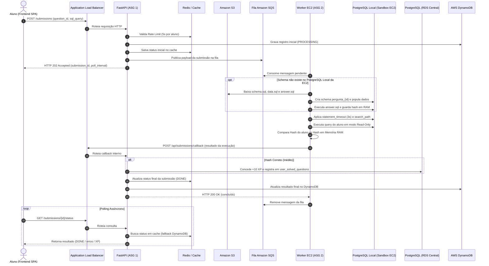

# Documento de Requisitos e Arquitetura do Sistema de Ensino de SQL (SQLArena)

## 1. Objetivo e Visão Geral
O **SQLArena** tem como objetivo fornecer uma plataforma elástica, isolada e interativa para o ensino e prática de comandos SQL. Ele permite que instrutores cadastrem exercícios práticos e que alunos submetam consultas SQL como resposta. A execução das consultas ocorre em um ambiente de banco de dados real (**PostgreSQL 16**), garantindo feedback fidedigno baseado no comportamento exato de um SGBD.

A arquitetura adota o padrão de **Single Page Application (SPA)** desacoplada no frontend (React + Tailwind CSS v4) comunicando-se de forma assíncrona com microsserviços de backend (**FastAPI** e **Workers EC2**), orquestrados por mensageria (**Amazon SQS**) e apoiados por bancos relacionais (**AWS RDS**), cache (**Redis**) e NoSQL (**DynamoDB**).

---

## 2. Arquitetura da Solução e Componentes

A infraestrutura é dividida em camadas desacopladas utilizando os seguintes serviços AWS e tecnologias:

* **Frontend SPA (React + Vite + Tailwind CSS v4):** Interface do usuário 100% responsiva e full-width. Possui camada dedicada de serviços (`src/services/`) com suporte a Mock desacoplado e chaveamento imediato para a API FastAPI.
* **Application Load Balancer (ALB):** Ponto de entrada público da aplicação web. Distribui o tráfego HTTP/HTTPS entre as instâncias da API FastAPI via *Round Robin* e roteia callbacks internos de conclusão dos Workers.
* **FastAPI (Camada Web / ASG 1):** Backend principal e **único serviço conectado diretamente ao AWS RDS e ao ElastiCache Redis**. Responsável por autenticação (JWT), rate limit (5s), validação de regras de negócio, CRUD de questões e categorias, publicação na fila SQS, leitura e gravação no DynamoDB, e recebimento do callback HTTP dos Workers (`POST /api/submissions/callback`) para consolidação de pontuação (+10 XP) e atualização de cache. **Não executa as consultas dos alunos**.
* **Amazon SQS (`sqlarena-submissions-queue`):** Fila de mensageria assíncrona que absorve os picos de tráfego e despacha as submissões dos alunos para os Workers de processamento.
* **Amazon EC2 (Workers + PostgreSQL Local em Sandbox / ASG 2):** Instâncias de processamento em background totalmente desacopladas do banco central. Cada máquina hospeda um Worker Python e um SGBD PostgreSQL local dedicado (sandbox descartável). Executa bootstrapping sob demanda a partir do Amazon S3, armazena hashes de gabaritos em tabela hash na memória RAM do processo, e notifica o término da avaliação via HTTP callback para a API FastAPI (via ALB), sem se conectar ao RDS ou Redis.
* **PostgreSQL (AWS RDS Central):** Banco relacional central acessado exclusivamente pela Camada Web. Armazena os dados de negócio: usuários, senhas criptografadas, metadados das questões, categorias pré-definidas, relações N:N de categorias e pontuações consolidadas (+10 XP).
* **Amazon S3 (`sqlarena-questions-bucket`):** Armazenamento seguro dos **scripts SQL puros** de cada questão (`schema.sql`, `data.sql`, `answer.sql`). **Não há utilização de arquivos CSV ou binários externos**; todos os dados residem como comandos SQL nativos. Alimentado pelo backend no cadastro de questões e consumido sob demanda pelos Workers para bootstrapping local.
* **Redis / ElastiCache:** Armazenamento em cache de chaves de controle, rate limit global por aluno (5 segundos) e status de submissões para polling do frontend. Acessado exclusivamente pela Camada Web.
* **Amazon DynamoDB:** Log imutável (NoSQL) composto por duas tabelas dedicadas:
  * `sqlarena-submissions-log`: Histórico completo de submissões, tempos de resposta, status e diagnósticos nativos do compilador PostgreSQL. Alimentado pelo Backend e consultado pelo modal de histórico e recuperação do Monaco Editor.
  * `sqlarena-crud-actions-log`: Auditoria de ações administrativas de criação, edição e exclusão de questões.

---

## 3. Elasticidade e Auto Scaling (Topologia de Duplo ASG)

Para atender a critérios rigorosos de elasticidade sob demanda e processamento concorrente seguro:

### 3.1. ASG 1: Camada Web (API FastAPI)
Gerencia a aplicação exposta à internet através do ALB:
* **Tipo de Instância:** Família `t2.micro` ou `t3.small`.
* **Rede:** Balanceada via Application Load Balancer (ALB).
* **Regras de Elasticidade (CloudWatch Target Tracking):**
  * **Scale Out:** Se a média de `CPUUtilization` do grupo exceder **70% por mais de 1 minuto**, uma nova instância será criada (até o máximo de 3).
  * **Scale In:** Se a média de `CPUUtilization` cair abaixo de **25% por mais de 1 minuto**, uma instância será finalizada.
  * **Limites:** Mínimo de 1 e Máximo de 3 instâncias.

### 3.2. ASG 2: Camada de Processamento (Workers)
Gerencia a execução assíncrona das consultas dos alunos, sem expor portas públicas HTTP:
* **Tipo de Instância:** Família `t2.micro` ou `t3.small` contendo o Worker e o PostgreSQL local.
* **Rede:** Pull-based a partir da fila Amazon SQS (`sqlarena-submissions-queue`).
* **Regras de Elasticidade:** Gatilho baseado na métrica `ApproximateNumberOfMessagesVisible` da SQS. Novas instâncias sobem conforme há acúmulo de submissões na fila, retornando ao mínimo quando a fila esvazia.
* **Limites:** Mínimo de 1 e Máximo de 3 instâncias.

---

## 4. Categorias e Organização Pedagógica (Relação N:N)

Para organizar o aprendizado de forma granular, as questões são categorizadas por tópicos pré-definidos do ecossistema SQL:

* **Tópicos Pré-definidos:**
  1. *Consultas Básicas* (`SELECT`, `WHERE`, `ORDER BY`, `LIMIT`, `DISTINCT`)
  2. *Lógica Condicional* (`CASE WHEN`, `COALESCE`, `NULLIF`)
  3. *Manipulação de Texto e Datas* (`DATE_TRUNC`, `EXTRACT`, `LIKE`, `CONCAT`)
  4. *Junções (JOINs)* (`INNER`, `LEFT`, `RIGHT`, `FULL`, `CROSS JOIN`)
  5. *Agrupamento & Agregações* (`GROUP BY`, `HAVING`, `SUM`, `AVG`, `COUNT`, `MIN/MAX`)
  6. *Subconsultas* (Escalares, Correlacionadas, `EXISTS`, `IN`, `NOT IN`)
  7. *Operações de Conjunto* (`UNION`, `UNION ALL`, `INTERSECT`, `EXCEPT`)
  8. *Funções de Janela (Window Functions)* (`OVER`, `PARTITION BY`, `ROW_NUMBER`, `RANK`, `LAG/LEAD`)
  9. *CTEs & Consultas Recursivas* (`WITH`, `WITH RECURSIVE`)

* **Modelagem Relacional (RDS PostgreSQL):**
  * Tabela `categories` (`id`, `name`, `slug`, `description`).
  * Tabela associativa `question_categories` (`question_id`, `category_id`), permitindo que uma questão receba **múltiplas categorias** simultaneamente (ex: uma questão que exige tanto *Junções* quanto *Agrupamento*).

---

## 5. Estrutura, Validação e Ciclo de Vida das Questões

As questões passam por validação estrita antes da publicação e são imutáveis após ativadas:

* **Ciclo de Estados:**
  * **DRAFT:** Estado inicial no cadastro pelo instrutor. Invisível para os alunos e não aceita submissões.
  * **READY:** Validação técnica concluída (os scripts SQL foram executados com sucesso na sandbox do PostgreSQL e o Hash canônico foi gravado no RDS e no Redis). Continua invisível aos alunos.
  * **PUBLISHED:** Questão pública. Disponível no mural para resolução pelos alunos.
* **Motor de Validação Dinâmica de Questões (`QuestionValidator`):**
  Durante o cadastro (via interface do instrutor ou seed do sistema), a aplicação executa um teste prévio automático:
  1. Cria um schema temporário isolado (`pergunta_{id}`).
  2. Executa o DDL (`schema.sql`) e a carga inicial DML (`data.sql`).
  3. Inspeciona as tabelas relacionais criadas para derivar e validar os dados de exemplo (`sample_tables`).
  4. Executa a consulta oficial (`answer.sql`), exigindo obrigatoriamente a presença de `ORDER BY`.
  5. Extrai as colunas esperadas (`expected_columns`) e calcula o Hash SHA-256 canônico determinístico.
  6. Se qualquer etapa falhar (erro de sintaxe, violação de integridade referencial ou ausência de `ORDER BY`), é disparado `DROP SCHEMA CASCADE` e a criação é rejeitada com mensagem descritiva.
  7. Se for bem-sucedida, o schema permanece provisionado e pronto para consultas dos alunos.
* **Exclusão Atômica:** O instrutor pode excluir uma questão a qualquer momento. A exclusão remove a questão do RDS, invalida o cache no Redis, apaga o schema sandbox no PostgreSQL e remove os scripts no S3. O histórico no DynamoDB permanece preservado para auditoria.

### 5.1. Armazenamento Exclusivo em Scripts SQL (Sem CSV)
Cada questão reside no S3 sob o prefixo `questions/{question_id}/` contendo estritamente três arquivos SQL:
1. `schema.sql`: Definição de tabelas, chaves primárias, chaves estrangeiras e índices (`CREATE TABLE`).
2. `data.sql`: Carga de dados inicial de teste (`INSERT INTO`).
3. `answer.sql`: Consulta gabarito canônica elaborada pelo instrutor.

* **Obrigatoriedade do ORDER BY no Gabarito:**
  Para garantir determinismo matemático estrito no resultado, o arquivo `answer.sql` **DEVE conter obrigatoriamente** a cláusula `ORDER BY`. O backend valida essa presença antes de permitir o cadastro.
* **Flexibilidade do Aluno:**
  O aluno **não** é obrigado a digitar explicitamente a palavra `ORDER BY`, contanto que o conjunto de dados retornado por sua consulta possua a mesma exata ordenação, colunas e valores do gabarito.

---

## 6. Motor de Execução Local em Sandbox (Workers EC2)

Os Workers da Camada de Processamento mantêm um SGBD PostgreSQL 16 instalado **localmente na própria instância EC2** (`localhost:5432`), garantindo isolamento absoluto de hardware em relação ao RDS central:

* **PostgreSQL Local Descartável:** Cada nó do ASG possui sua própria base PostgreSQL local (`sandbox_db`). Nenhuma consulta de aluno é executada no banco RDS de produção, garantindo *blast radius* zero contra falhas de CPU ou memória.
* **Bootstrapping sob Demanda (*Lazy Loading* do S3):** O Worker não precisa carregar previamente todas as questões no boot da máquina. Ao receber uma submissão da fila SQS para a questão `N`:
  1. O Worker verifica se o schema `pergunta_N` já existe no PostgreSQL local;
  2. Se não existir, faz o download dos scripts puros (`schema.sql`, `data.sql`, `answer.sql`) do **Amazon S3** sob o prefixo `questions/N/`;
  3. Cria o schema `pergunta_N`, executa o DDL e popula os dados no banco local;
  4. Executa a query gabarito `answer.sql` no banco local, calcula o Hash SHA-256 oficial e o armazena na **tabela hash em memória RAM** do Worker.
* **Isolamento de Schemas:** Cada questão possui um schema exclusivo (ex: `pergunta_10`). Antes de executar a consulta do aluno, o Worker aplica `SET search_path TO pergunta_10, public`.
* **Segurança e Privilégios Mínimos:** A consulta do aluno é executada com `conn.set_session(readonly=True)`. Qualquer tentativa de DDL (`CREATE`, `DROP`, `ALTER`) ou DML de escrita (`INSERT`, `UPDATE`, `DELETE`) é imediatamente rejeitada pelo SGBD.
* **Prevenção de Abusos e Timeouts:** O Worker define `SET statement_timeout = '3000'` (3 segundos) na sessão antes de rodar a query, prevenindo loops infinitos, *Cross Joins* cartesianos e exaustão de CPU.
* **Single-Thread Worker:** O Worker consome uma única mensagem da SQS por vez, executa, notifica o Backend e limpa a mensagem da fila, evitando condições de corrida (*race conditions*).
* **Desacoplamento Completo de RDS e Redis:** O Worker não possui credenciais do RDS nem do Redis. Ele comunica o resultado final via chamada HTTP (`POST /api/submissions/callback`) ao Application Load Balancer.

---

## 7. Comparação Rigorosa e Tabela Hash em Memória RAM (Strict Mode)

Para garantir máxima performance, latência ultrabaixa e imunidade a falhas de rede:

* **Tabela Hash em Memória RAM no Worker ($O(1)$ Puro):**
  1. Durante o bootstrapping da questão a partir do S3, o resultado do `answer.sql` é executado no PostgreSQL local e serializado em formato canônico determinístico (nomes de colunas em minúsculas, tipos, ordenação exata de linhas, nulos e valores).
  2. Esse gabarito é convertido em um **Hash SHA-256 canônico** e armazenado diretamente em um dicionário Python na memória RAM do Worker (`self.cached_hashes[question_id]`).
  3. Quando o aluno submete sua consulta, o Worker executa-a no PostgreSQL local, gera o hash SHA-256 do resultado e compara diretamente com o valor residente em sua memória RAM. Não há dependência de chamadas de rede externas ao Redis para validar gabaritos.
* **Strict Mode (Regra de 100%):**
  Não existe tolerância para divergência de tipos ou formatação (ex: `FLOAT` diverge de `NUMERIC`; `10.5` diverge de `10.50`). Se os hashes divergirem, a resposta é classificada como `WRONG_ANSWER`.
* **Diagnósticos Técnicos Educativos:**
  Caso a consulta falhe por erro de sintaxe ou coluna inexistente, o log nativo de erro do PostgreSQL local (ex: `column "x" does not exist (LINE 2)`) é capturado e devolvido ao aluno como ferramenta de diagnóstico.

---

## 8. Submissões, Rate Limit, Pontuação e Estado Inicial

* **Rate Limit Global:** Intervalo mínimo obrigatório de **5 segundos** por aluno entre qualquer tentativa de submissão, verificado via Redis e FastAPI. Requisições recebidas antes de 5 segundos retornam erro HTTP 429 com contagem regressiva.
* **Início Limpo dos Usuários (Sem Scores Fictícios):**
  Todos os usuários iniciam com pontuação zerada (`score = 0`), zero questões resolvidas (`solved_count = 0`) e frequência zerada (`streak_days = 0`). Não há questões pré-resolvidas no banco ou no histórico.
* **Sistema de Pontuação:** Cada questão acertada de forma inédita concede **+10 XP** ao aluno (consolidado no RDS). Tentativas incorretas ou submissões repetidas de questões já resolvidas não acumulam pontos adicionais.
* **Registro Imutável no DynamoDB:** Todas as tentativas (completas, com erro de sintaxe ou gabarito divergente) são gravadas imutavelmente no DynamoDB (`sqlarena-submissions-log`) contendo timestamp, código SQL, tempo de execução (ms) e pontuação.
* **Cache Inteligente de Questões (Redis):** As listagens e detalhes de questões públicas são cacheados no Redis (`TTL 300s`), sendo invalidadas instantaneamente em operações de CRUD ou publicação pelo instrutor.

---

## 9. Fluxo Transacional Completo (Aluno)



---

## 10. Especificação da Interface do Usuário (Frontend SPA)

O frontend foi desenvolvido com foco em usabilidade e performance, eliminando layouts estreitos ou tipografias de estilo retrô/pixel art:

### 10.1. Padrão Visual e Tipografia
* **Tema Padrão:** **Tema Claro** por padrão (`#f8fafc`), com suporte a **Tema Escuro Suavizado** em tons de cinza carvão/ardósia (`#16181e` e `#1f232b`), evitando pretos absolutos e eliminando tons excessivos de roxo ou azul neon.
* **Tipografia:** Fonte principal **Inter** (alta legibilidade, base 16px) para interface e **JetBrains Mono** para blocos de código e comandos SQL.
* **Aproveitamento de Tela:** Layout **100% full-width** (`w-full px-6 lg:px-12`) sem restrições arbitrárias de largura (`max-w-*`).

### 10.2. Mural de Questões (Dashboard)
* Mural responsivo de cartões com micro-animações no cursor (`hover:-translate-y-1 hover:shadow-md`).
* Barra de progresso geral e contador de frequência de estudo (*streak* diário).
* Barra combinada de busca textual (por título ou categoria) e filtros por **Categoria Pré-definida**, **Dificuldade** (Fácil, Médio, Difícil) e **Status** (Todas, Resolvidas, Pendentes).

### 10.3. Arena de Resolução de Questões
* **Barra de Questão Travada (`sticky`):** O cabeçalho contendo o botão de voltar, título da questão, badges de dificuldade e tópicos permanece fixo no topo (`sticky top-[65px] z-30`) logo abaixo da Navbar durante a rolagem.
* **Painéis de Referência à Esquerda (Rolagem Independente):**
  1. *Enunciado da Questão:* Instruções de negócio e colunas esperadas.
  2. *Modelo Relacional:* Diagrama interativo gerado dinamicamente a partir do DDL SQL com visualização de chaves primárias e estrangeiras.
  3. *Dados de Exemplo:* Acordeão que permite abrir múltiplas tabelas simultaneamente para inspeção de linhas reais.
* **Editor SQL Monaco à Direita (Travado na Tela):**
  * Ocupa toda a altura disponível da viewport (`h-[calc(100vh-230px)]`).
  * Não redimensionável manualmente, com barra de rolagem interna suave para scripts longos.
  * **Estado Inicial Limpo e Restauração Inteligente:** Se o aluno ainda não tentou a questão, o editor inicia completamente limpo (`""`), sem códigos pré-digitados ou templates indesejados. Caso o aluno já tenha submetido consultas anteriores para a questão (mesmo que com erro), a última consulta enviada é restaurada dinamicamente via API (`GET /api/submissions/last?question_id={id}`), permitindo continuar de onde parou.
  * Execução rápida via atalho de teclado `Ctrl + Enter` ou botão de execução com feedback de carregamento.
  * Botão de Tela Cheia (*Fullscreen*) para foco total.
  * Drawer de resultados com tempo de execução (ms), linhas retornadas e banner de diagnóstico.

### 10.4. Histórico de Submissões em Modal Dinâmico
* **Botão Direto na Navbar:** Botão dedicado "Histórico de Submissões" posicionado à esquerda do perfil do usuário. Substitui o antigo modal resumido de fila, fornecendo acesso direto ao histórico completo.
* **Histórico em Modal (Preservação de Contexto):**
  * O histórico completo abre como um modal sobreposto sobre a tela atual, **sem fazer o aluno perder o código nem o estado de trabalho na Arena**.
  * Botão de **Atualizar** (`RotateCw`) sob demanda.
  * Atalho de filtro inteligente para visualizar apenas as tentativas da questão atual.
  * Ação direta **"Carregar no Editor"**, enviando o código SQL de qualquer tentativa passada diretamente para o Monaco Editor da Arena.

### 10.5. Painel do Instrutor / Criador
* Interface sóbria, utilitária e focada na produtividade técnica do instrutor.
* Multi-seletor de categorias pré-definidas.
* Editores de texto dimensionados para scripts SQL completos (`schema.sql`, `data.sql`, `answer.sql`).
* Validação automática no envio para garantir a presença obrigatória da cláusula `ORDER BY` no gabarito.

---

## 11. Camada de Serviços do Frontend (Preparada para FastAPI)

O frontend comunica-se exclusivamente através da camada de serviços em `frontend/src/services/`:

| Arquivo de Serviço | Responsabilidade | Endpoint Backend Ativo |
| :--- | :--- | :--- |
| `api.js` | Instância central do Axios com flag `USE_MOCK = false` e interceptor JWT | `http://localhost:8000/api` |
| `authService.js` | Autenticação por email e senha, obtenção de JWT e gestão de sessão | `POST /auth/login` |
| `categoryService.js` | Listagem das 12 categorias pré-definidas em ordem alfabética | `GET /categories` |
| `questionService.js` | Listagem com filtros, detalhe de questão e criação com validação de `ORDER BY` | `GET /questions`, `GET /questions/{id}`, `POST /questions` |
| `submissionService.js` | Envio de submissões para fila SQS, polling assíncrono de status e histórico | `POST /submissions`, `GET /submissions/{id}/status`, `GET /submissions/history` |
| `auditService.js` | Consulta aos logs de auditoria imutáveis persistidos no DynamoDB | `GET /audit/actions` |

A constante `USE_MOCK` em `src/services/api.js` está definida como `false` por padrão, conectando o frontend diretamente à API FastAPI.

---

## 12. Matriz de Rastreabilidade e Conformidade dos Requisitos

| Requisito | Descrição | Status | Componentes / Arquivos de Implementação |
| :--- | :--- | :---: | :--- |
| **REQ-01** | Banco relacional central para metadados, categorias N:N, questões e pontuações | **Atendido (100%)** | `app/database/models.py`, `app/database/session.py`, `app/database/seed.py`, PostgreSQL (RDS 15432) |
| **REQ-02** | 12 categorias pré-definidas com relação N:N (`question_categories`) | **Atendido (100%)** | `app/database/models.py`, `app/database/seed.py`, `app/api/categories.py` |
| **REQ-03** | Armazenamento de questões exclusivamente em scripts SQL puros (`schema.sql`, `data.sql`, `answer.sql`) no S3 | **Atendido (100%)** | `app/s3/s3_manager.py`, `app/database/seed.py`, `app/api/questions.py` |
| **REQ-04** | Obrigatoriedade de `ORDER BY` na resposta oficial (`answer.sql`) validada antes da publicação | **Atendido (100%)** | `app/api/questions.py`, `app/database/validator.py`, `app/database/seed.py`, `frontend/src/pages/ProfessorPage.jsx` |
| **REQ-05** | Cache Redis para rate limit (5s) e hash SHA-256 canônico do gabarito para comparação O(1) | **Atendido (100%)** | `app/cache/redis_client.py`, `app/api/submissions.py`, `app/worker/executor.py` |
| **REQ-06** | Fila Amazon SQS (`sqlarena-submissions-queue`) desacoplando a API dos Workers | **Atendido (100%)** | `app/sqs/queue_manager.py`, `app/api/submissions.py`, `app/worker/main.py` |
| **REQ-07** | Workers em background com motor PostgreSQL 16 isolado por schema (`pergunta_X`), Read-Only e timeout de 3s | **Atendido (100%)** | `app/worker/executor.py`, `app/worker/main.py`, PostgreSQL Sandbox |
| **REQ-08** | Sistema de pontuação: +10 XP para acertos inéditos consolidados no banco RDS | **Atendido (100%)** | `app/worker/executor.py`, `app/database/models.py` (coluna `score` em `users`) |
| **REQ-09** | Log imutável de submissões e ações administrativas no Amazon DynamoDB | **Atendido (100%)** | `app/dynamodb/dynamo_manager.py`, `app/worker/main.py`, `app/api/questions.py` |
| **REQ-10** | Frontend SPA 100% responsivo, Monaco Editor com atalho `Ctrl+Enter`, histórico dinâmico sem perda de contexto | **Atendido (100%)** | `frontend/src/` (React 19 + Vite 6 + Tailwind CSS v4 + Monaco Editor) |
| **REQ-11** | Infraestrutura como Código (Terraform) cobrindo VPC, Duplo ASG, ALB, RDS, ElastiCache, S3, SQS e DynamoDB | **Atendido (100%)** | `terraform/*.tf`, `terraform/worker_asg.tf`, `terraform/alb.tf`, `terraform/asg.tf` |

---

## 13. Guia de Verificação e Validação Manual

Para auditar e testar manualmente cada requisito de ponta a ponta:

1. **Subida da Infraestrutura Docker:**
   ```powershell
   docker compose -f ministack/docker-compose.yml up -d
   ```
2. **Execução do Seed de Dados:**
   ```powershell
   $env:PYTHONPATH="."; & app/.venv/Scripts/python.exe app/database/seed.py
   ```
   *Verificação:* O seed deve criar as 12 categorias, usuários de teste, 21 questões com scripts no S3, schemas isolados no PostgreSQL e hashes no Redis.
3. **Inicialização do Backend e Worker:**
   * Terminal 1: `uvicorn app.main:app --reload --host 0.0.0.0 --port 8000`
   * Terminal 2: `python app/worker/main.py`
4. **Inicialização do Frontend:**
   * Terminal 3: `cd frontend; npm run dev`
5. **Cenários de Teste na Interface (`http://localhost:5173`):**
   * **Cenário A - Autenticação:** Fazer login com `aluno@sqlarena.com` / `123456`.
   * **Cenário B - Mural & Filtros:** Testar filtro de categorias e status no Dashboard.
   * **Cenário C - Resolução Correta (Arena):** Entrar em uma questão, executar a query correta com `Ctrl + Enter`. Verificar no terminal do Worker o processamento da mensagem da SQS, comparação de hash SHA-256 no Redis, atualização do status para `ACCEPTED` no frontend e ganho de +10 XP no perfil.
   * **Cenário D - Rate Limit (5s):** Submeter duas vezes em menos de 5 segundos e verificar o bloqueio amigável com contagem regressiva.
   * **Cenário E - Erro de Sintaxe:** Digitar uma query inválida e verificar a exibição do erro nativo retornado pelo PostgreSQL.
   * **Cenário F - Tentativa Incorreta (`WRONG_ANSWER`):** Executar um `SELECT` com dados divergentes e verificar a resposta sem pontuação extra.
   * **Cenário G - Histórico:** Abrir o modal de histórico na Navbar e clicar em "Carregar no Editor" em uma tentativa passada.
   * **Cenário H - Painel do Instrutor:** Logar como `instrutor@sqlarena.com` / `123456`, acessar a página de criação de questões e testar a obrigatoriedade da cláusula `ORDER BY` no gabarito.