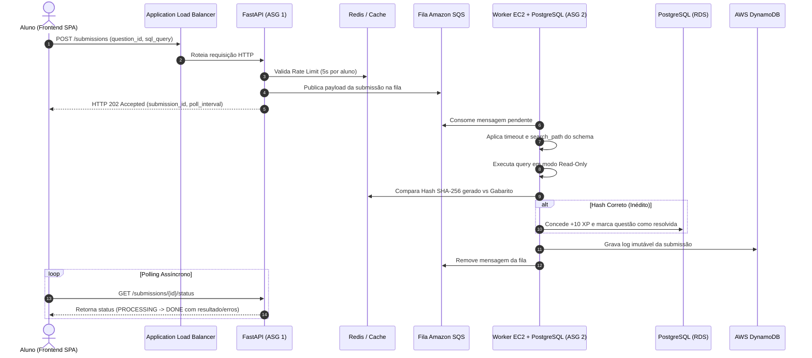

# Documento de Requisitos e Arquitetura do Sistema de Ensino de SQL (SQLArena)

## 1. Objetivo e Visão Geral
O **SQLArena** tem como objetivo fornecer uma plataforma elástica, isolada e interativa para o ensino e prática de comandos SQL. Ele permite que instrutores cadastrem exercícios práticos e que alunos submetam consultas SQL como resposta. A execução das consultas ocorre em um ambiente de banco de dados real (**PostgreSQL 16**), garantindo feedback fidedigno baseado no comportamento exato de um SGBD.

A arquitetura adota o padrão de **Single Page Application (SPA)** desacoplada no frontend (React + Tailwind CSS v4) comunicando-se de forma assíncrona com microsserviços de backend (**FastAPI** e **Workers EC2**), orquestrados por mensageria (**Amazon SQS**) e apoiados por bancos relacionais (**AWS RDS**), cache (**Redis**) e NoSQL (**DynamoDB**).

---

## 2. Arquitetura da Solução e Componentes

A infraestrutura é dividida em camadas desacopladas utilizando os seguintes serviços AWS e tecnologias:

* **Frontend SPA (React + Vite + Tailwind CSS v4):** Interface do usuário 100% responsiva e full-width. Possui camada dedicada de serviços (`src/services/`) com suporte a Mock desacoplado e chaveamento imediato para a API FastAPI.
* **Application Load Balancer (ALB):** Ponto de entrada público da aplicação web. Distribui o tráfego HTTP/HTTPS entre as instâncias da API FastAPI via *Round Robin*.
* **FastAPI (Camada Web / ASG 1):** Backend principal. Responsável por autenticação (JWT), rate limit (5s), validação de regras de negócio, CRUD de questões e categorias, e publicação das submissões dos alunos na fila SQS. **Não executa as consultas dos alunos**.
* **Amazon SQS (`sqlarena-submissions-queue`):** Fila de mensageria assíncrona que absorve os picos de tráfego e despacha as submissões dos alunos para os Workers de processamento.
* **Amazon EC2 (Workers + PostgreSQL em Sandbox / ASG 2):** Instâncias de processamento pesado em background. Cada máquina hospeda um Worker e um SGBD PostgreSQL local, processando uma submissão por vez em schema isolado.
* **PostgreSQL (AWS RDS):** Banco relacional central que armazena os metadados da aplicação: usuários, questões, categorias pré-definidas, relações N:N de categorias e pontuações consolidadas.
* **Amazon S3 (`sqlarena-questions-bucket`):** Armazenamento seguro dos **scripts SQL puros** de cada questão (`schema.sql`, `data.sql`, `answer.sql`). **Não há utilização de arquivos CSV ou binários externos**; todos os dados residem como comandos SQL nativos.
* **Redis / ElastiCache:** Armazenamento em cache de chaves de controle, rate limit global por aluno (5 segundos) e do **Hash canônico SHA-256** do gabarito oficial de cada questão.
* **Amazon DynamoDB:** Log imutável (NoSQL) composto por duas tabelas dedicadas:
  * `sqlarena-submissions-log`: Histórico completo de submissões, tempos de resposta, status e diagnósticos nativos do compilador PostgreSQL.
  * `sqlarena-crud-actions-log`: Auditoria de ações administrativas de criação, edição e exclusão de questões.

---

## 3. Elasticidade e Auto Scaling (Topologia de Duplo ASG)

Para atender a critérios rigorosos de elasticidade sob demanda e processamento concorrente seguro:

### 3.1. ASG 1: Camada Web (API FastAPI)
Gerencia a aplicação exposta à internet através do ALB:
* **Tipo de Instância:** Família `t2.micro` ou `t3.small`.
* **Rede:** Balanceada via Application Load Balancer (ALB).
* **Regras de Elasticidade (CloudWatch Target Tracking):**
  * **Scale Out:** Se a média de `CPUUtilization` do grupo exceder **70% por mais de 1 minuto**, uma nova instância será criada (até o máximo de 3).
  * **Scale In:** Se a média de `CPUUtilization` cair abaixo de **25% por mais de 1 minuto**, uma instância será finalizada.
  * **Limites:** Mínimo de 1 e Máximo de 3 instâncias.

### 3.2. ASG 2: Camada de Processamento (Workers)
Gerencia a execução assíncrona das consultas dos alunos, sem expor portas públicas HTTP:
* **Tipo de Instância:** Família `t2.micro` ou `t3.small` contendo o Worker e o PostgreSQL local.
* **Rede:** Pull-based a partir da fila Amazon SQS (`sqlarena-submissions-queue`).
* **Regras de Elasticidade:** Gatilho baseado na métrica `ApproximateNumberOfMessagesVisible` da SQS. Novas instâncias sobem conforme há acúmulo de submissões na fila, retornando ao mínimo quando a fila esvazia.
* **Limites:** Mínimo de 1 e Máximo de 3 instâncias.

---

## 4. Categorias e Organização Pedagógica (Relação N:N)

Para organizar o aprendizado de forma granular, as questões são categorizadas por tópicos pré-definidos do ecossistema SQL:

* **Tópicos Pré-definidos:**
  1. *Consultas Básicas* (`SELECT`, `WHERE`, `ORDER BY`, `LIMIT`, `DISTINCT`)
  2. *Lógica Condicional* (`CASE WHEN`, `COALESCE`, `NULLIF`)
  3. *Manipulação de Texto e Datas* (`DATE_TRUNC`, `EXTRACT`, `LIKE`, `CONCAT`)
  4. *Junções (JOINs)* (`INNER`, `LEFT`, `RIGHT`, `FULL`, `CROSS JOIN`)
  5. *Agrupamento & Agregações* (`GROUP BY`, `HAVING`, `SUM`, `AVG`, `COUNT`, `MIN/MAX`)
  6. *Subconsultas* (Escalares, Correlacionadas, `EXISTS`, `IN`, `NOT IN`)
  7. *Operações de Conjunto* (`UNION`, `UNION ALL`, `INTERSECT`, `EXCEPT`)
  8. *Funções de Janela (Window Functions)* (`OVER`, `PARTITION BY`, `ROW_NUMBER`, `RANK`, `LAG/LEAD`)
  9. *CTEs & Consultas Recursivas* (`WITH`, `WITH RECURSIVE`)

* **Modelagem Relacional (RDS PostgreSQL):**
  * Tabela `categories` (`id`, `name`, `slug`, `description`).
  * Tabela associativa `question_categories` (`question_id`, `category_id`), permitindo que uma questão receba **múltiplas categorias** simultaneamente (ex: uma questão que exige tanto *Junções* quanto *Agrupamento*).

---

## 5. Estrutura e Ciclo de Vida das Questões

As questões são imutáveis após a publicação para garantir consistência e reprodutibilidade:

* **Ciclo de Estados:**
  * **DRAFT:** Estado inicial no cadastro pelo instrutor. Invisível para os alunos e não aceita submissões.
  * **READY:** Validação técnica concluída (os scripts SQL foram executados com sucesso no PostgreSQL e o Hash canônico foi gravado no Redis). Continua invisível aos alunos.
  * **PUBLISHED:** Questão pública. Disponível no mural para resolução pelos alunos.
* **Exclusão Atômica:** O instrutor pode excluir uma questão a qualquer momento. O ID nunca é reutilizado. A exclusão remove a questão do RDS, apaga o prefixo `questions/{id}/` no S3 e emite um evento para os Workers removerem o respectivo schema local. O histórico no DynamoDB permanece preservado para auditoria.

### 5.1. Armazenamento Exclusivo em Scripts SQL (Sem CSV)
Cada questão reside no S3 sob o prefixo `questions/{question_id}/` contendo estritamente três arquivos SQL:
1. `schema.sql`: Definição de tabelas, chaves primárias, chaves estrangeiras e índices (`CREATE TABLE`).
2. `data.sql`: Carga de dados inicial de teste (`INSERT INTO`).
3. `answer.sql`: Consulta gabarito canônica elaborada pelo instrutor.

* **Obrigatoriedade do ORDER BY no Gabarito:**
  Para garantir determinismo matemático estrito no resultado, o arquivo `answer.sql` **DEVE conter obrigatoriamente** a cláusula `ORDER BY`. O backend valida essa presença antes de permitir a transição para `READY`.
* **Flexibilidade do Aluno:**
  O aluno **não** é obrigado a digitar explicitamente a palavra `ORDER BY`, contanto que o conjunto de dados retornado por sua consulta possua a mesma exata ordenação, colunas e valores do gabarito.

---

## 6. Motor de Execução Local em Sandbox (Workers EC2)

Os Workers da Camada de Processamento mantêm um SGBD PostgreSQL 16 local:

* **Isolamento de Schemas:** Cada questão possui um schema exclusivo (ex: `pergunta_10`). Antes de executar a consulta do aluno, o Worker aplica `SET search_path TO pergunta_10`.
* **Segurança e Privilégios Mínimos:** A consulta do aluno é executada sob uma *role* de banco limitada exclusivamente a comandos de leitura (`SELECT`). Qualquer tentativa de DDL (`CREATE`, `DROP`, `ALTER`) ou DML de escrita (`INSERT`, `UPDATE`, `DELETE`) é imediatamente rejeitada pelo SGBD.
* **Prevenção de Abusos e Timeouts:** O Worker define `SET statement_timeout = '3000'` (3 segundos) na sessão antes de rodar a query, prevenindo loops infinitos, *Cross Joins* cartesianos e exaustão de CPU.
* **Single-Thread Worker:** O Worker consome uma única mensagem da SQS por vez, executa, limpa a mensagem e passa para a próxima, evitando condições de corrida (*race conditions*).

---

## 7. Comparação Rigorosa e Hashes de Resposta (Strict Mode)

Para garantir máxima performance de rede e economia de tráfego entre instâncias:

* **Validação por SHA-256:**
  1. Durante a validação da questão, o resultado do `answer.sql` é executado no PostgreSQL e serializado em uma representação canônica textual determinística (incluindo nomes de colunas, tipos, ordenação exata de linhas, nulos e valores).
  2. Essa representação canônica é convertida em um **Hash SHA-256** e armazenada no Redis.
  3. Quando o aluno submete sua consulta, o Worker executa-a no PostgreSQL local e gera o hash SHA-256 do resultado produzido.
  4. A validação do acerto é uma comparação direta de Hashes (O(1)).
* **Strict Mode (Regra de 100%):**
  Não existe tolerância para divergência de tipos ou formatação (ex: `FLOAT` diverge de `NUMERIC`; `10.5` diverge de `10.50`). Se os hashes divergirem, a resposta é classificada como `WRONG_ANSWER`.
* **Diagnósticos Técnicos Educativos:**
  Caso a consulta falhe por erro de sintaxe ou coluna inexistente, o log nativo de erro do PostgreSQL (ex: `column "x" does not exist (LINE 2)`) é capturado e devolvido ao aluno como ferramenta de diagnóstico.

---

## 8. Submissões, Rate Limit e Pontuação

* **Rate Limit Global:** Intervalo mínimo obrigatório de **5 segundos** por aluno entre qualquer tentativa de submissão, verificado via Redis e FastAPI. Requisições recebidas antes de 5 segundos retornam erro com contagem regressiva.
* **Sistema de Pontuação:** Cada questão acertada de forma inédita concede **+10 XP** ao aluno (consolidado no RDS). Tentativas incorretas ou submissões repetidas de questões já resolvidas não acumulam pontos adicionais.
* **Registro Imutável no DynamoDB:** Todas as tentativas (completas, com erro de sintaxe ou gabarito divergente) são gravadas imutavelmente no DynamoDB (`sqlarena-submissions-log`) contendo timestamp, código SQL, tempo de execução (ms) e pontuação.

---

## 9. Fluxo Transacional Completo (Aluno)

---

## 10. Especificação da Interface do Usuário (Frontend SPA)

O frontend foi desenvolvido com foco em usabilidade e performance, eliminando layouts estreitos ou tipografias de estilo retrô/pixel art:

### 10.1. Padrão Visual e Tipografia
* **Tema Padrão:** **Tema Claro** por padrão (`#f8fafc`), com suporte a **Tema Escuro Suavizado** em tons de cinza carvão/ardósia (`#16181e` e `#1f232b`), evitando pretos absolutos e eliminando tons excessivos de roxo ou azul neon.
* **Tipografia:** Fonte principal **Inter** (alta legibilidade, base 16px) para interface e **JetBrains Mono** para blocos de código e comandos SQL.
* **Aproveitamento de Tela:** Layout **100% full-width** (`w-full px-6 lg:px-12`) sem restrições arbitrárias de largura (`max-w-*`).

### 10.2. Mural de Questões (Dashboard)
* Mural responsivo de cartões com micro-animações no cursor (`hover:-translate-y-1 hover:shadow-md`).
* Barra de progresso geral e contador de frequência de estudo (*streak* diário).
* Barra combinada de busca textual (por título ou categoria) e filtros por **Categoria Pré-definida**, **Dificuldade** (Fácil, Médio, Difícil) e **Status** (Todas, Resolvidas, Pendentes).

### 10.3. Arena de Resolução de Questões
* **Barra de Questão Travada (`sticky`):** O cabeçalho contendo o botão de voltar, título da questão, badges de dificuldade e tópicos permanece fixo no topo (`sticky top-[65px] z-30`) logo abaixo da Navbar durante a rolagem.
* **Painéis de Referência à Esquerda (Rolagem Independente):**
  1. *Enunciado da Questão:* Instruções de negócio e colunas esperadas.
  2. *Modelo Relacional:* Diagrama interativo gerado dinamicamente a partir do DDL SQL com visualização de chaves primárias e estrangeiras.
  3. *Dados de Exemplo:* Acordeão que permite abrir múltiplas tabelas simultaneamente para inspeção de linhas reais.
* **Editor SQL Monaco à Direita (Travado na Tela):**
  * Ocupa toda a altura disponível da viewport (`h-[calc(100vh-230px)]`).
  * Não redimensionável manualmente, com barra de rolagem interna suave para scripts longos.
  * Execução rápida via atalho de teclado `Ctrl + Enter` ou botão de execução com feedback de carregamento.
  * Botão de Tela Cheia (*Fullscreen*) para foco total.
  * Drawer de resultados com tempo de execução (ms), linhas retornadas e banner de diagnóstico.

### 10.4. Fila de Submissões & Histórico em Modal Dinâmico
* **Fila Recente na Navbar:** Botão posicionado imediatamente à esquerda do perfil do usuário com indicador luminoso de atividade, exibindo as últimas 5 submissões com status em tempo real.
* **Histórico em Modal (Preservação de Contexto):**
  * O histórico completo abre como um modal sobreposto sobre a tela atual, **sem fazer o aluno perder o código nem o estado de trabalho na Arena**.
  * Botão de **Atualizar** (`RotateCw`) sob demanda.
  * Atalho de filtro inteligente para visualizar apenas as tentativas da questão atual.
  * Ação direta **"Carregar no Editor"**, enviando o código SQL de qualquer tentativa passada diretamente para o Monaco Editor da Arena.

### 10.5. Painel do Instrutor / Criador
* Interface sóbria, utilitária e focada na produtividade técnica do instrutor.
* Multi-seletor de categorias pré-definidas.
* Editores de texto dimensionados para scripts SQL completos (`schema.sql`, `data.sql`, `answer.sql`).
* Validação automática no envio para garantir a presença obrigatória da cláusula `ORDER BY` no gabarito.

---

## 11. Camada de Serviços do Frontend (Preparada para FastAPI)

O frontend comunica-se exclusivamente através da camada de serviços em `frontend/src/services/`:

| Arquivo de Serviço | Responsabilidade | Endpoint Backend Futuro |
| :--- | :--- | :--- |
| `api.js` | Instância central do Axios com flag `USE_MOCK` e JWT Interceptor | Base URL da API |
| `authService.js` | Autenticação por email e senha e gestão de sessão | `POST /auth/login` |
| `categoryService.js` | Listagem de categorias pré-definidas | `GET /categories` |
| `questionService.js` | Listagem, detalhes e cadastro de questões com validação de `ORDER BY` | `GET /questions`, `POST /questions` |
| `submissionService.js` | Validação de Rate Limit (5s), envio de submissão, polling e histórico persistente | `POST /submissions`, `GET /submissions/{id}/status` |
| `auditService.js` | Registro local de auditoria de operações | `GET /audit/actions` |

Para conectar a aplicação ao backend real em FastAPI, basta alternar a constante `USE_MOCK = false` em `src/services/api.js`.